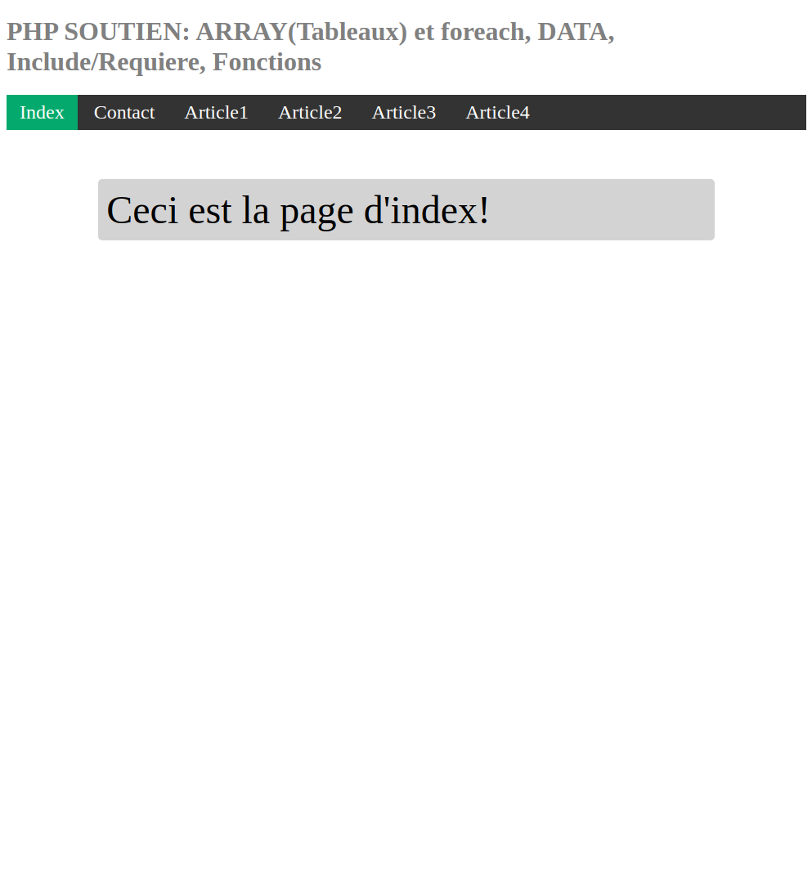

# Soutien PHP Henri

L'objectif est de s'entraîner avec les fonctions de bases PHP et les imbriquer avec du HTML. Je vous fourni les fichiers de départ index.php et contact.php ainsi que la feuille de style.css
Tous ces éléments sont dans le même répertoire afin de faciliter la suite de l'exercice.
Vous avez également la correction du soutien dans le repertoire solution.

## Notions vues dans l'exercice

require / include
if
creation tableau (array)
foreach
endforeach (syntaxe alternative)

## Etape 1 - Création de templates

Vous devez créer un repertoire inc (vous pouvez le nommer autrement).
Dans ce repertoire inc nous allons créer deux fichiers
    head.tpl.php
    header.tpl.php

Dans ces deux fichiers il faut copier le head et le header du fichier index.php
Ensuite dans le fichier index.php et contact.php il faut remplacer le head et le header en utilisant la fonction include ou require

## Etape 2 - Automatisation de la barre de navigation

Nous allons créer un nouveau template "data" ou vous devrez créer un tableau qui contiendra les labels de notre barre de navigation ainsi que les url. (les labels sont les noms que l'on souhaite afficher sur notre barre de navigation)
Nous donnerons comme nom à ce tableau  $barre_de_navigation et comme nom de template data.php (dans notre repertoire inc)

Ensuite il faut modifier notre fichier header.tpl.php afin d'automatiser cette barre de navigation (la partie avec les balises li).
Attention, à cette étape vous avez peut être vu qu'il existe plusieurs classes sur nos deux balises li qui représentent le bouton index et contact. La classe "navli" permet de préciser que c'est un bouton de base noir. la classe active transforme le bouton en vert afin de signaler la page active.
Pour le moment vous pouvez utiliser la même classe pour tous les boutons, soit class="navli active"
Tous vos boutons seront donc vert après cette étape. Dans l'étape suivante nous corrigerons le problème.

Pour automatiser la barre de navigation vous aurez besoin de foreach et endforeach (si vous utilisez la syntaxe alternative que je vous conseil d'utiliser quand vous mélangez html/php).

## Etape 3 - Gestion du bouton vert noir

Pour pouvoir gérer automatiquement dans notre barre de navigation l'affichage du bouton vert ou noir nous allons devoir effectuer les étapes suivantes:

Dans notre fichier index.php et contact.php vous allez devoir créer une variable $page_active contenant le nom de la page.
Dans index.php ce sera "Index.php"  (Attention la valeur de votre variable doit être identique à celle dans votre tableau data. Avec ou sans majuscule mais identique)

Cette variable doit être initialisé (crée) avant les require ou include.

Ensuite il faut retourner dans notre fichier header.tpl.php et améliorer notre boucle foreach
Vous devez intégrer un if dans votre boucle afin d'afficher uniquement "active" dans la class de votre li uniquement si la variable $page_active est = (==) à $label.

Normalement à cette étape vous devriez retrouver les boutons verts et noirs fonctionnels sur votre barre de navigation.

## Etape 4 - Création de 4 pages supplémentaires et mise à jour auto de la barre de navigation:

Vous pouvez créer 4 pages supplémentaires article1.php, artcile2.php, .... Vous pouvez copier coller la page index ou contact et modifier la valeur de la variable $page_active et le texte à l'intérieur du main.

Ensuite mettez à jour votre tableau $barre_de_navigation et normalement votre barre de navigation devrait être mise à jour et fonctionnelle pour toutes les pages de votre site.

## Mot de la fin

J'espère que je n'ai rien oublié et que c'est un peu près clair. Je n'avais pas prévu de partager l'exercice sur GitHub mais comme on me l'a demandé le voici. 
